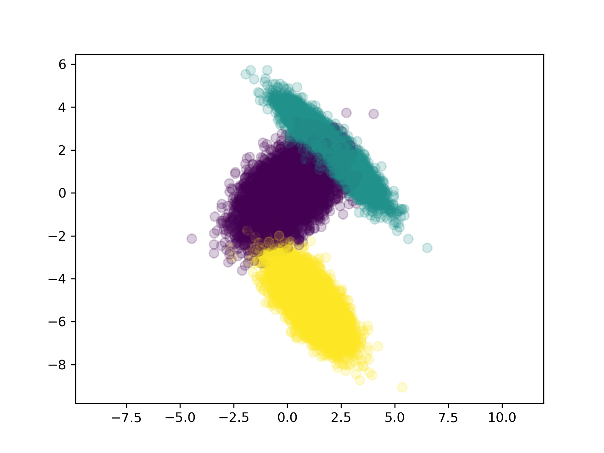
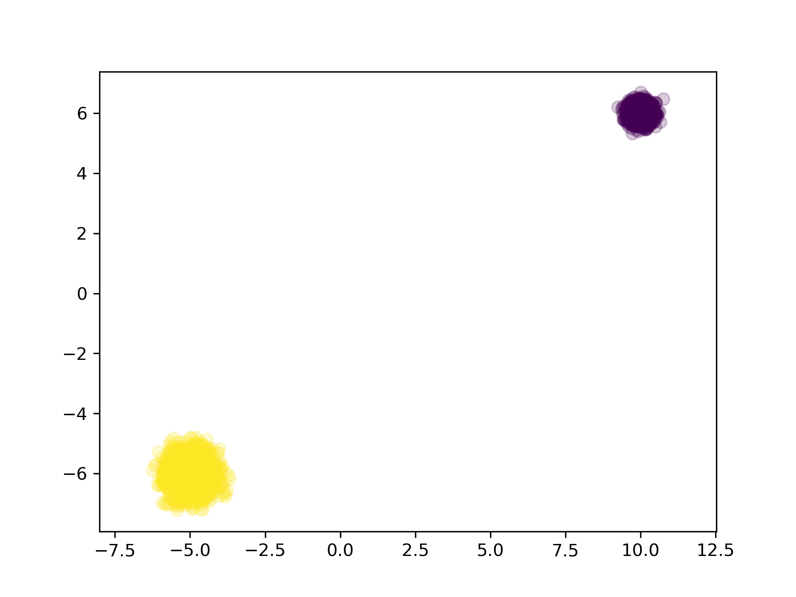
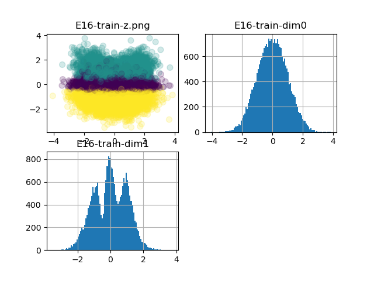
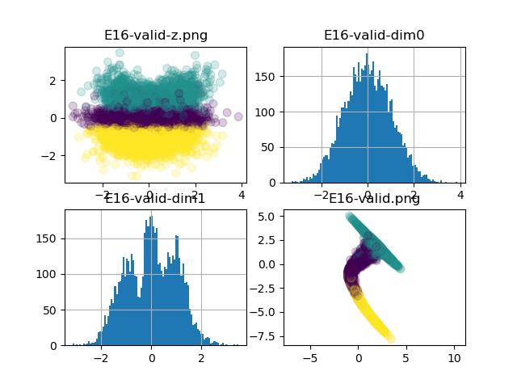
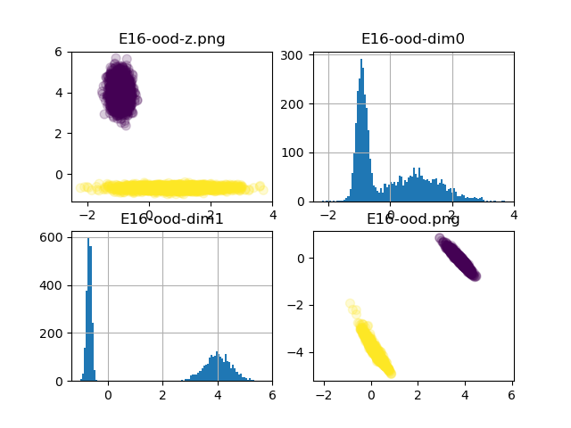

# Understanding of VAE

## The Latent Variable

### Experiment

I have an experiment of VAE, the train and OOD dataset is as follows

After some epochs, the latent and reconstruction is as follows

### Conclusion
- the latent variable will obey the standard normal distribution
- VAE also can generate the OOD distribution
- we can't use latent distribution to detect anomaly, because the case is only a datapoint and can not reflect the distribution
